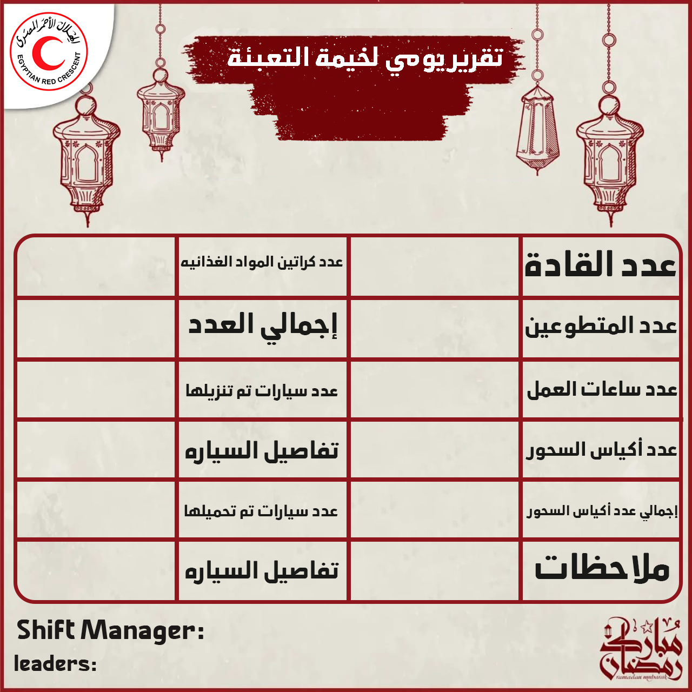

# Egyptian Red Crescent
a GUI app that make a daily report photo (Ramdan Season) from Packing TENT in the ERC to add it to the logs or publish it to social media.

## Libraries

### PIL
```bash
pip install pillow
```

### arabic_reshaper
```bash
pip install arabic_reshaper
```

### python-bidi
```bash
pip install python-bidi

```

## Photos 
### GUI


### Raw Photo


### Output
- 

- 